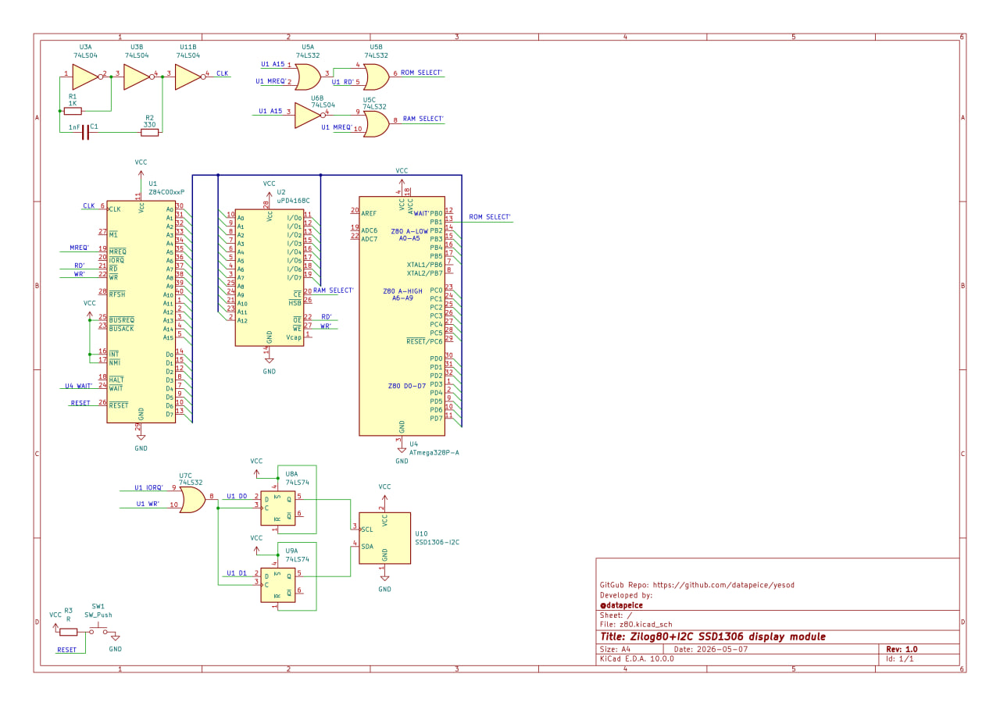

Project YESOD 

Z80 Bare-Metal OLED Driver
YESOD is a low-level project focused on interfacing the legendary Zilog Z80 CPU with modern SSD1306 OLED displays via a manually implemented I2C protocol.

`No HAL, no libraries, no OS. Just pure Z80 Assembly, raw I/O ports, and precise bit-banging.`

Technical Stack
CPU: Zilog Z80 (The heart of the system).
Storage Emulation: Arduino Nano as a emulated ROM.
Display: SSD1306 128x64 OLED with i2c interface
Language: Z80 Assembly (compilator - pasmo https://pasmo.speccy.org/).

System Architecture
The following schematic illustrates the bus wiring between the Z80, the Arduino Nano (ROM Emulator), and the I2C peripherals.

